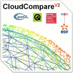

### Hey there , I'm Fernando Pimenta

I am a Data Science Specialist, Surveying and Cartography Engineer and Biosystems Engineer. I develop and use geotechnologies to solve challenges in multidisciplinary fields of science such as cartography, geodesy, remote sensing, food security, water resources, territorial management and public policies.

### Connect with me :smiley:

 

### Some Academic Reseach
:page_with_curl: [Historical Changes in Land Use and Suitability for Future Agriculture Expansion in Western Bahia, Brazil](https://www.mdpi.com/2072-4292/13/6/1088)

:page_with_curl: [Patterns of land use, extensification, and intensification of Brazilian agriculture](http://doi.wiley.com/10.1111/gcb.13314)

:page_with_curl: [ Climate Change and Intense Irrigation Growth in Western Bahia, Brazil: The Urgent Need for Hydroclimatic Monitoring](https://www.mdpi.com/2073-4441/11/5/933)

:page_with_curl: [Carbon stocks and dynamics of different land uses on the Cerrado agricultural frontier](https://dx.plos.org/10.1371/journal.pone.0241637)

:page_with_curl: [Influence of climate variability, fire and phosphorus limitation on vegetation structure and dynamics of the Amazon–Cerrado border](https://bg.copernicus.org/articles/15/919/2018/)

:page_with_curl: [Influence of climate variability, fire and phosphorus limitation on vegetation structure and dynamics of the Amazon–Cerrado border](https://bg.copernicus.org/articles/15/919/2018/)

:blue_book: [Servidores de mapas: programação para disponibilizar dados geográficos multidisciplinares utilizando tecnologias livres](https://www.embrapa.br/busca-de-publicacoes/-/publicacao/950263/servidores-de-mapas-programacao-para-disponibilizar-dados-geograficos-multidisciplinares-utilizando-tecnologias-livres)

:point_right: [More research and work can be found on my Lattes](http://lattes.cnpq.br/0646984654461300) :point_left:

### Technologies I use

   

  

    
  

 
