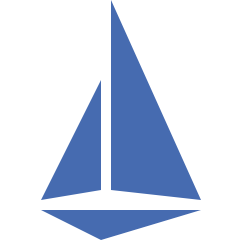
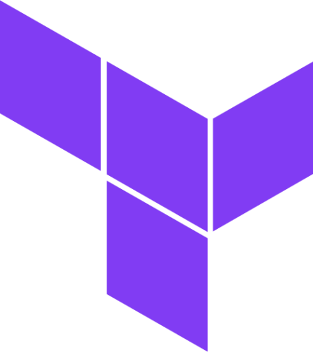
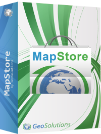
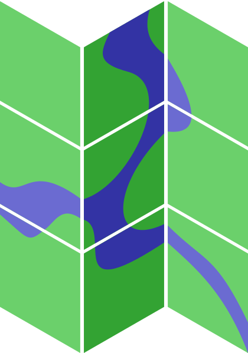
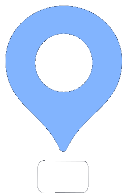
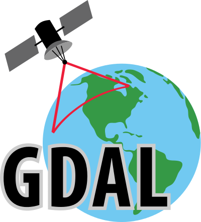
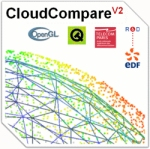

# Fernando Pimenta

**Geospatial Solutions Architect** — Designing enterprise-grade geospatial ecosystems that bridge cutting-edge technology with business impact.

## About

Architect specializing in scalable geospatial platforms, from strategic design to implementation and operations. I work across the full solution lifecycle, integrating cloud-native infrastructure, real-time analytics, and digital twin technologies into complex enterprise environments.

**Key areas:** Solution & Infrastructure Architecture · Enterprise Integration · Data Engineering · Digital Twins · DevOps & CI/CD · AI/ML for Spatial Analytics

## 🔭 Currently Working On

- Real-time Digital Twin platforms for smart city and environmental monitoring
- Cloud-native geospatial architectures with Kubernetes and service mesh
- Large-scale spatial data pipelines for precision agriculture

## Solution Architecture

### Enterprise Platforms

- **Spatial Data Lakehouses** — Multi-petabyte geospatial data architectures with optimized query performance
- **Real-time Analytics** — Streaming platforms for location intelligence and IoT sensor data
- **Digital Twins** — Real-time replicas integrating IoT sensors, satellite imagery, and predictive modeling for environmental and infrastructure monitoring
- **Cloud-Native Services** — Containerized microservices with Docker, Kubernetes, and service mesh, designed for high-availability and disaster recovery

### Industry Focus

- **Smart Cities & Urban Planning** — GIS platforms integrating IoT, citizen services, and real-time monitoring
- **Environmental Monitoring** — Large-scale climate research and natural resource management systems
- **Agriculture & Precision Farming** — End-to-end monitoring, yield prediction, and resource optimization
- **Energy & Utilities** — Asset management, grid optimization, and predictive maintenance
- **Government & Defense** — Secure on-premise solutions for critical infrastructure with air-gapped architectures

### Integration & Strategy

RESTful/GraphQL APIs · Data Mesh Architecture · AI/ML Pipelines · IoT Sensor Integration

## 🌐 Languages

- **Portuguese** — Native
- **English** — Professional proficiency

## Connect

  
  &nbsp;&nbsp;
  
  &nbsp;&nbsp;
  
  &nbsp;&nbsp;
  

## Research & Publications

### Selected Publications

- **[Historical Changes in Land Use and Suitability for Future Agriculture Expansion in Western Bahia, Brazil](https://www.mdpi.com/2072-4292/13/6/1088)**  
  _Remote Sensing Journal_ - Land use analysis and agricultural expansion modeling

- **[Patterns of land use, extensification, and intensification of Brazilian agriculture](http://doi.wiley.com/10.1111/gcb.13314)**  
  _Global Change Biology_ - Agricultural intensification patterns analysis

- **[Climate Change and Intense Irrigation Growth in Western Bahia, Brazil: The Urgent Need for Hydroclimatic Monitoring](https://www.mdpi.com/2073-4441/11/5/933)**  
  _Water Journal_ - Climate variability and irrigation impact assessment

- **[Carbon stocks and dynamics of different land uses on the Cerrado agricultural frontier](https://dx.plos.org/10.1371/journal.pone.0241637)**  
  _PLOS ONE_ - Carbon cycle modeling in agricultural systems

- **[Influence of climate variability, fire and phosphorus limitation on vegetation structure and dynamics of the Amazon–Cerrado border](https://bg.copernicus.org/articles/15/919/2018/)**  
  _Biogeosciences_ - Ecosystem dynamics and climate interaction modeling

### Technical Publications

- **[Map Servers: Programming for multidisciplinary geographic data delivery using open source technologies](https://www.embrapa.br/busca-de-publicacoes/-/publicacao/950263/servidores-de-mapas-programacao-para-disponibilizar-dados-geograficos-multidisciplinares-utilizando-tecnologias-livres)** `[pt-BR]`  
  _Embrapa_ - Technical guide for geospatial web services implementation

**[Complete publication list available on Lattes CV](http://lattes.cnpq.br/0646984654461300)**

## Architecture & Technology Expertise

### Infrastructure Architecture (Cloud, Hybrid & On-Premise)

  
  &nbsp;&nbsp;
  
  &nbsp;&nbsp;
  
  &nbsp;&nbsp;
  
  &nbsp;&nbsp;
  
  &nbsp;&nbsp;
  
  &nbsp;&nbsp;
  
  &nbsp;&nbsp;
  
  &nbsp;&nbsp;
  
  &nbsp;&nbsp;
  
  &nbsp;&nbsp;
  
  &nbsp;&nbsp;
  
  &nbsp;&nbsp;
  
  &nbsp;&nbsp;
  
  &nbsp;&nbsp;
  
  &nbsp;&nbsp;
  
  &nbsp;&nbsp;
  
  &nbsp;&nbsp;
  

### Enterprise Geospatial Platforms

  
  &nbsp;&nbsp;
  
  &nbsp;&nbsp;
  
  &nbsp;&nbsp;
  
  &nbsp;&nbsp;
  
  &nbsp;&nbsp;
  
  &nbsp;&nbsp;
  

### Data Architecture & Processing

  
  &nbsp;&nbsp;
  
  &nbsp;&nbsp;
  
  &nbsp;&nbsp;
  
  &nbsp;&nbsp;
  
  &nbsp;&nbsp;
  
  &nbsp;&nbsp;
  
  &nbsp;&nbsp;
  
  &nbsp;&nbsp;
  
  &nbsp;&nbsp;
  
  &nbsp;&nbsp;
  
&nbsp;&nbsp;

### Solution Development Stack

  
  &nbsp;&nbsp;
  
  &nbsp;&nbsp;
  
  &nbsp;&nbsp;
  
  &nbsp;&nbsp;
  
  &nbsp;&nbsp;
  
  &nbsp;&nbsp;
  
  &nbsp;&nbsp;
  
  &nbsp;&nbsp;
  
  &nbsp;&nbsp;
  
  &nbsp;&nbsp;
  
  &nbsp;&nbsp;
  

### Analytics & Research Tools

  
  &nbsp;&nbsp;
  
  &nbsp;&nbsp;
  
  &nbsp;&nbsp;
  

## GitHub Statistics

  

---

## 💬 Let's Connect

I'm open to collaboration on geospatial open-source projects, digital twin initiatives, and enterprise architecture challenges. Feel free to reach out via [LinkedIn](https://www.linkedin.com/in/fernando-m-pimenta/) or explore my repositories.
