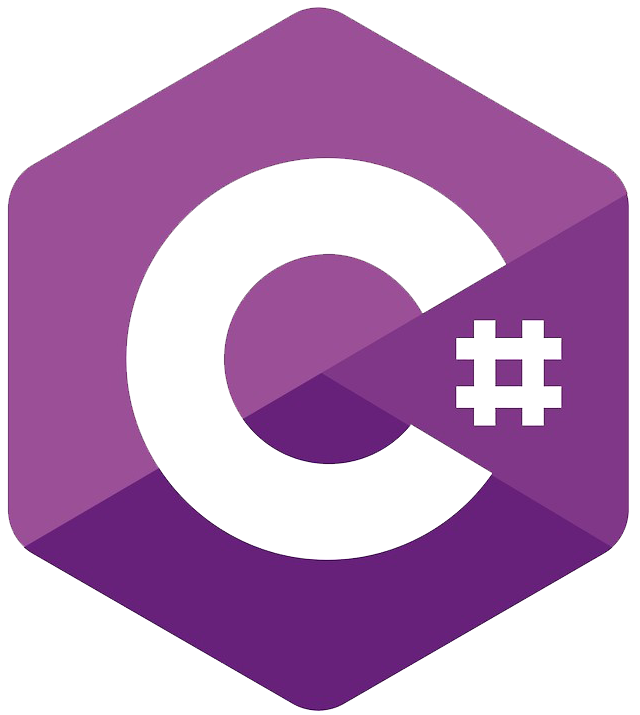
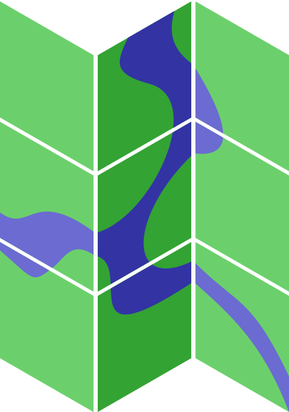

# Hey there , I'm Fernando Pimenta

## About

I am a geospatial data scientist and DevOps engineer specializing in the development and implementation of **Geospatial Data Infrastructures (GDI)** integrated with modern DevOps practices. My expertise combines:

- **Geospatial Data Infrastructure**: Design, development, and maintenance of enterprise-grade GDI systems
- **DevOps & Automation**: Implementation of CI/CD pipelines, infrastructure as code, and automated deployment workflows
- **Data Science & AI**: Application of machine learning and AI techniques to geospatial datasets
- **Research & Development**: Focus on climate analysis, urban planning, and natural resource management

My work bridges the gap between robust technical infrastructure and actionable geospatial insights, enabling data-driven decision making across various sectors including environmental monitoring, agriculture, and urban development.

## Connect

  
  &nbsp;&nbsp;
  
  &nbsp;&nbsp;
  
  &nbsp;&nbsp;
  

## Research & Publications

### Selected Publications

- **[Historical Changes in Land Use and Suitability for Future Agriculture Expansion in Western Bahia, Brazil](https://www.mdpi.com/2072-4292/13/6/1088)**  
  _Remote Sensing Journal_ - Land use analysis and agricultural expansion modeling

- **[Patterns of land use, extensification, and intensification of Brazilian agriculture](http://doi.wiley.com/10.1111/gcb.13314)**  
  _Global Change Biology_ - Agricultural intensification patterns analysis

- **[Climate Change and Intense Irrigation Growth in Western Bahia, Brazil: The Urgent Need for Hydroclimatic Monitoring](https://www.mdpi.com/2073-4441/11/5/933)**  
  _Water Journal_ - Climate variability and irrigation impact assessment

- **[Carbon stocks and dynamics of different land uses on the Cerrado agricultural frontier](https://dx.plos.org/10.1371/journal.pone.0241637)**  
  _PLOS ONE_ - Carbon cycle modeling in agricultural systems

- **[Influence of climate variability, fire and phosphorus limitation on vegetation structure and dynamics of the Amazon–Cerrado border](https://bg.copernicus.org/articles/15/919/2018/)**  
  _Biogeosciences_ - Ecosystem dynamics and climate interaction modeling

### Technical Publications

- **[Map Servers: Programming for multidisciplinary geographic data delivery using open source technologies](https://www.embrapa.br/busca-de-publicacoes/-/publicacao/950263/servidores-de-mapas-programacao-para-disponibilizar-dados-geograficos-multidisciplinares-utilizando-tecnologias-livres)**  
  _Embrapa_ - Technical guide for geospatial web services implementation

**[Complete publication list available on Lattes CV](http://lattes.cnpq.br/0646984654461300)**

## Technology Stack

### Geospatial & GIS

  
  &nbsp;&nbsp;
  
  &nbsp;&nbsp;
  
  &nbsp;&nbsp;
  
  &nbsp;&nbsp;
  
  &nbsp;&nbsp;
  
  &nbsp;&nbsp;
  

### Programming Languages

  
  &nbsp;&nbsp;
  
  &nbsp;&nbsp;
  
  &nbsp;&nbsp;
  
  &nbsp;&nbsp;
  
  &nbsp;&nbsp;
  
  &nbsp;&nbsp;
  
  &nbsp;&nbsp;
  

### Web Development

  
  &nbsp;&nbsp;
  
  &nbsp;&nbsp;
  
  &nbsp;&nbsp;
  
  &nbsp;&nbsp;
  
  &nbsp;&nbsp;
  

### Databases & Spatial

  
  &nbsp;&nbsp;
  

### Geospatial Web Services

  
  &nbsp;&nbsp;
  
  &nbsp;&nbsp;
  
  &nbsp;&nbsp;
  

### DevOps & Infrastructure

  
  &nbsp;&nbsp;
  
  &nbsp;&nbsp;
  
  &nbsp;&nbsp;
  
  &nbsp;&nbsp;
  

### Development Tools

  

## GitHub Statistics

  

